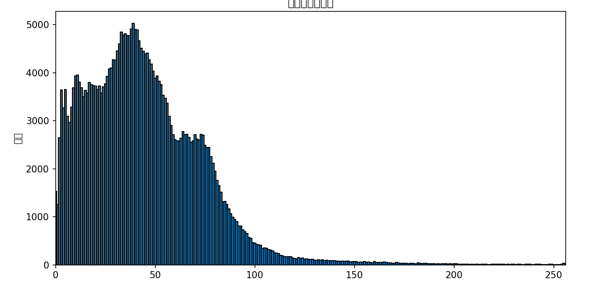
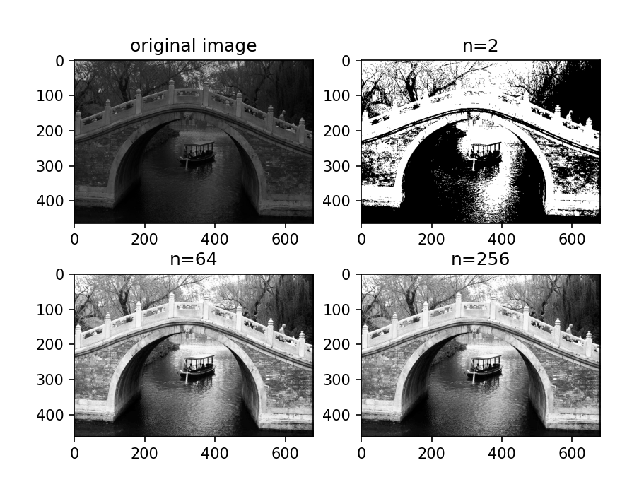
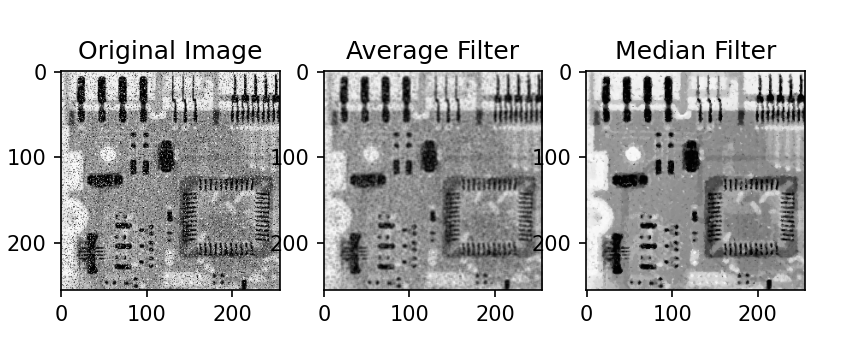
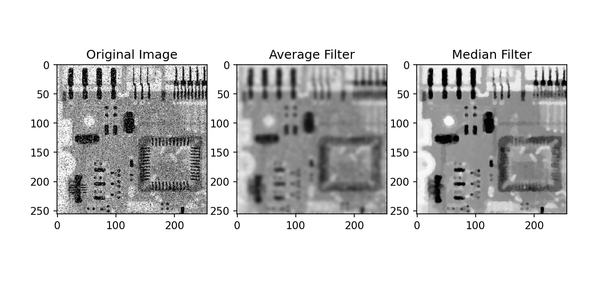
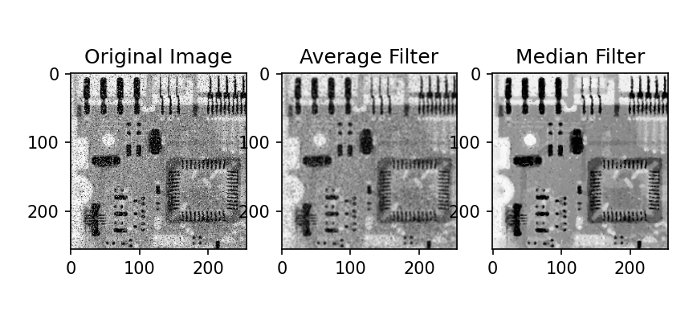
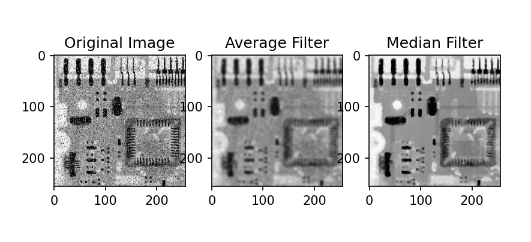
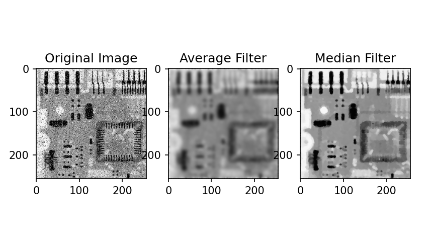
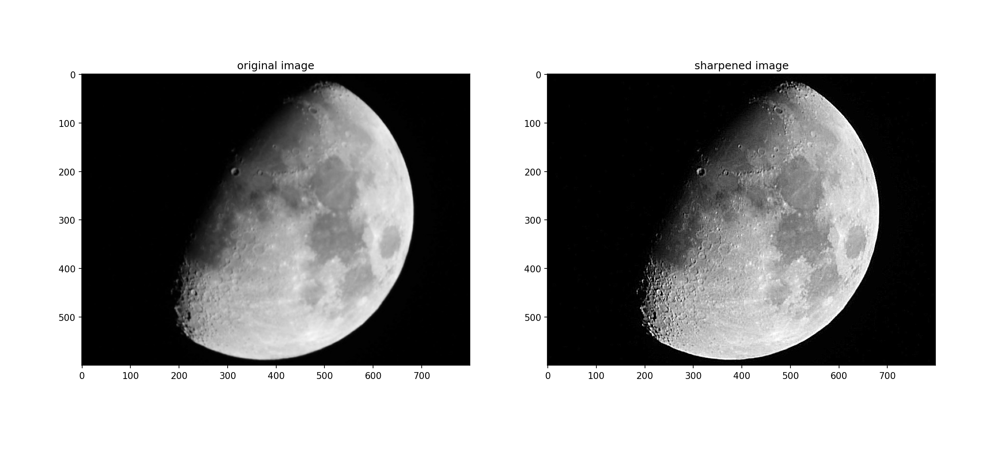
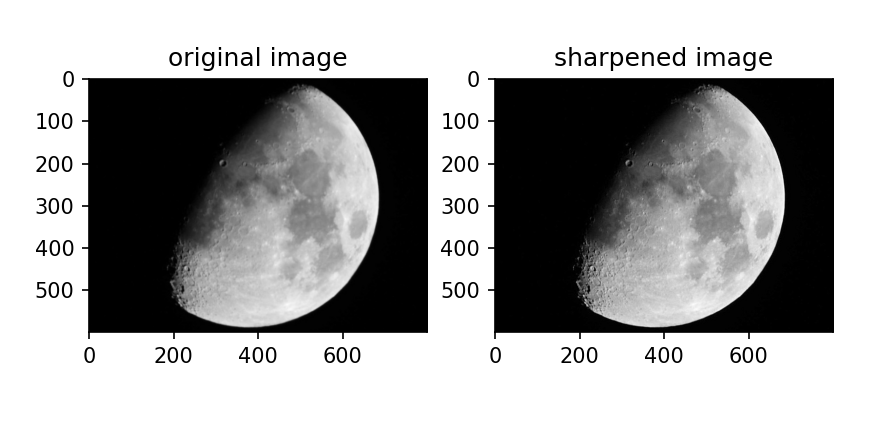

# lab2 直方图均衡化与空域滤波

**PB21020685   王润泽**

## 1. 实验内容

使用python，实现直方图均衡化与空域滤波。

## 2. 实验原理
### 2.1 直方图均衡化

直方图均衡化是一种图像增强技术，旨在改善图像的对比度，使得图像的直方图分布更均匀。其基本原理是调整图像的灰度值，使得每个灰度级的出现频率接近相等。通过计算图像的累积分布函数（CDF），可以得到一个映射关系，将原始像素值转换为新的像素值，从而实现均衡化。

#### 具体步骤：

1. 计算图像的直方图。
2. 计算累计分布函数（CDF）。
3. 根据 CDF 创建映射关系。
4. 应用映射关系到原始图像，生成均衡化后的图像。

### 2.2 空域滤波

空域滤波是图像处理的一种基本方法，主要通过对图像像素值的空间邻域进行处理，达到平滑、锐化或其他效果。常用的滤波方法包括均值滤波和中值滤波。

- **均值滤波**：通过对每个像素的邻域进行平均化，减小图像中的噪声。均值滤波器的计算通常涉及一个滑动窗口内的像素平均值。
- **中值滤波**：通过将每个像素值替换为其邻域像素值的中位数，有效去除椒盐噪声，保留图像边缘信息。

### 2.3 图片锐化

图像锐化是一种增强图像细节的方法，通过突出图像的边缘和细节，使图像更加清晰。常用的锐化方法包括拉普拉斯算子和Sobel算子。

## 3. 实验结果

### 3.1 直方图均衡化

对桥梁图像进行直方图均衡化，结果如下：

- 原始直方图

- 均衡化后的图像

可以看出，随着n的增大，图像的对比度逐渐增强，细节更加清晰。

### 3.2 空域滤波

对受到椒盐噪声污染的电路板X射线图像进行均值滤波和中值滤波.

- 当使用``cv2.filter2D(image, -1, kernel)``进行滤波时，结果如下：

- 使用自己实现的算法时，卷积核大小为3*3，迭代次数为10，结果如下：

- 卷积核大小为3*3，迭代次数为1，结果如下：

- 卷积核大小为3*3，迭代次数为5，结果如下：

- 卷积核大小为3*3，迭代次数为20，结果如下：

可以看出，均值滤波能够有效去除图像中的噪声，但会导致图像模糊；中值滤波则能够保留图像的边缘信息，去除噪声的同时保持图像的清晰度。中值滤波相较于均值滤波，更适合处理椒盐噪声。

### 3.3 图片锐化

对模糊图像进行拉普拉斯算子锐化，分别使用两种不同的拉普拉斯算子，结果如下：

可以看出，拉普拉斯算子能够突出图像的边缘和细节，使图像更加清晰。

