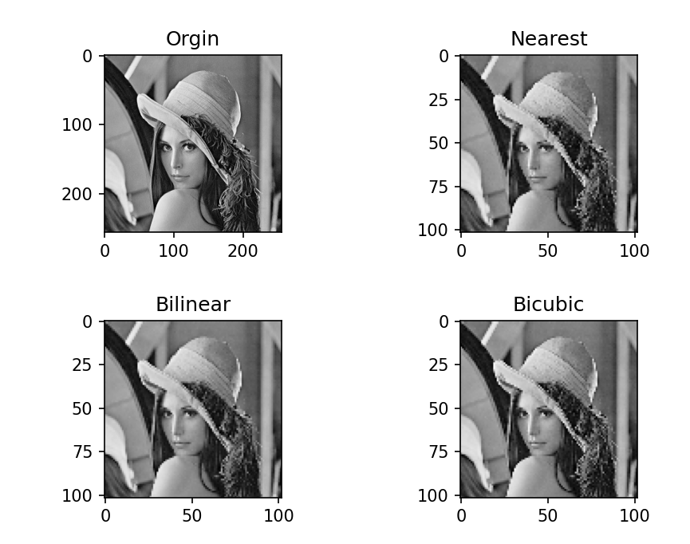
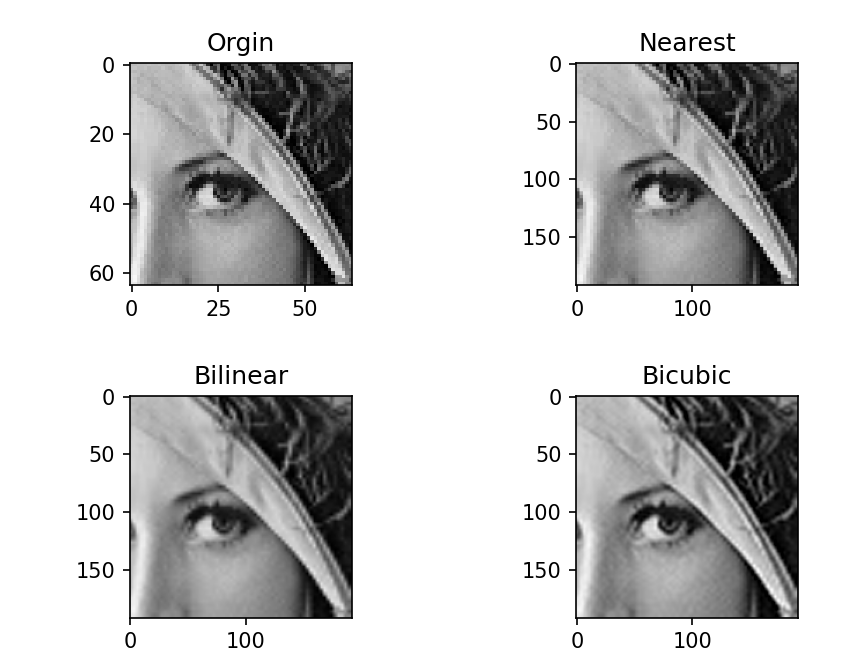
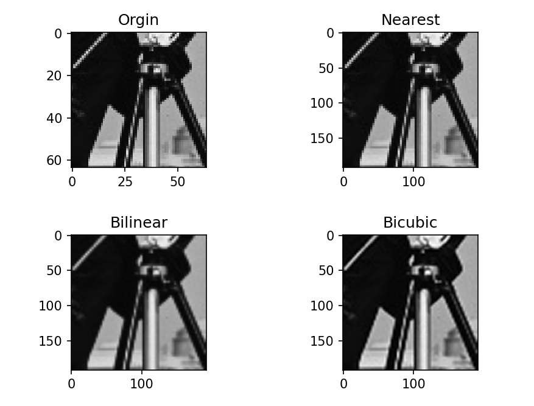
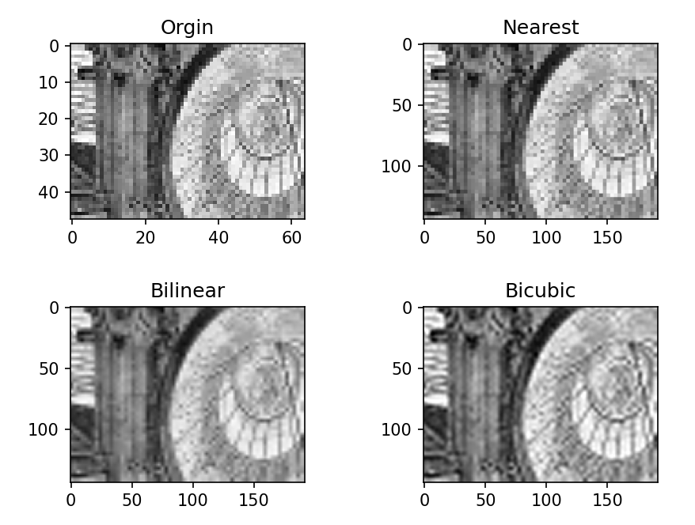

# lab1 图像插值

**PB21020685   王润泽**

## 1. 实验目的

实现最近邻内插、双线性内插和双三次内插方法，对比这些插值方法在图像缩放中的效果。

### 最近邻内插

**最近邻内插**是一种基于最邻近像素的简单插值方法。对于目标像素位置 `(x, y)`，其插值过程如下：

1. **确定最邻近像素**： 找到原图中距离 `(x, y)` 最近的整数坐标像素 `(x_0, y_0)`。

2. **赋值**： 目标像素 `(x, y)` 的值等于最近邻像素 `(x_0, y_0)` 的值：

   I(x,y)=I(x0,y0)I(x, y) = I(x_0, y_0)I(x,y)=I(x0,y0)

其中，`I(x, y)` 表示目标像素的值，`I(x_0, y_0)` 表示最近邻像素的值。

### 双线性内插

**双线性内插**是一种基于目标点周围四个像素点的插值方法。对于目标像素位置 `(x, y)`，其插值过程如下：

1. **确定四个邻近像素**：

   - 目标点 `(x, y)` 位于原图中的四个已知像素 `(x_0, y_0)`, `(x_1, y_0)`, `(x_0, y_1)`, 和 `(x_1, y_1)` 的矩形区域内。

2. **计算插值系数**： 计算目标点相对于四个邻近像素的相对位置：

      $$a = x - x_1,b = y - y_1$$

3. **计算插值结果**： 使用双线性插值公式计算目标像素 `(i, j)` 的值：

      $$I(i,j)=(1−a)⋅(1−b)⋅I(x1,y1)+a⋅(1−b)⋅I(x2,y1)+(1−a)⋅b⋅I(x1,y2)+a⋅b⋅I(x2,y2)I(i, j) $$

      其中：

      - `I(x_1, y_1)` 是左上角像素的值
      - `I(x_2, y_1)` 是右上角像素的值
      - `I(x_1, y_2)` 是左下角像素的值
      - `I(x_2, y_2)` 是右下角像素的值

      通过将目标像素值插值为其四个邻近像素的加权平均，双线性内插能有效地平滑图像的缩放效果。

### 双三次内插

**双三次内插**是一种高质量插值方法，利用目标点周围 16 个像素点进行插值。其步骤如下：

1. **确定 16 个邻近像素**：

   -  目标点 `(x, y)` 位于原图中的 4x4 矩形区域内，由 16 个像素点组成。

2. **解方程组**：
   - 通过目标点周围的 16 个像素点，构建 16 个方程，解出 16 个系数。

## 3. 实验结果

在实验中，我们对比了三种插值方法在不同图像上的效果。以下是插值结果的示例：

## 4. 分析与讨论

- **最近邻插值**：虽然速度较快，但图像质量较差，出现了明显的锯齿状边缘。适用于实时处理或对图像质量要求不高的场景。
- **双线性插值**：提供了比最近邻插值更平滑的结果，但在大幅度缩放时，可能仍然存在模糊现象。适用于对图像质量有一定要求的应用。
- **双三次插值**：在所有方法中，提供了最平滑和细节最丰富的结果。尽管计算复杂度较高，但在需要高质量图像时，是最优选择。

通过实验，我们能够理解不同插值方法的效果和适用场景，从而在实际应用中选择最合适的插值算法。