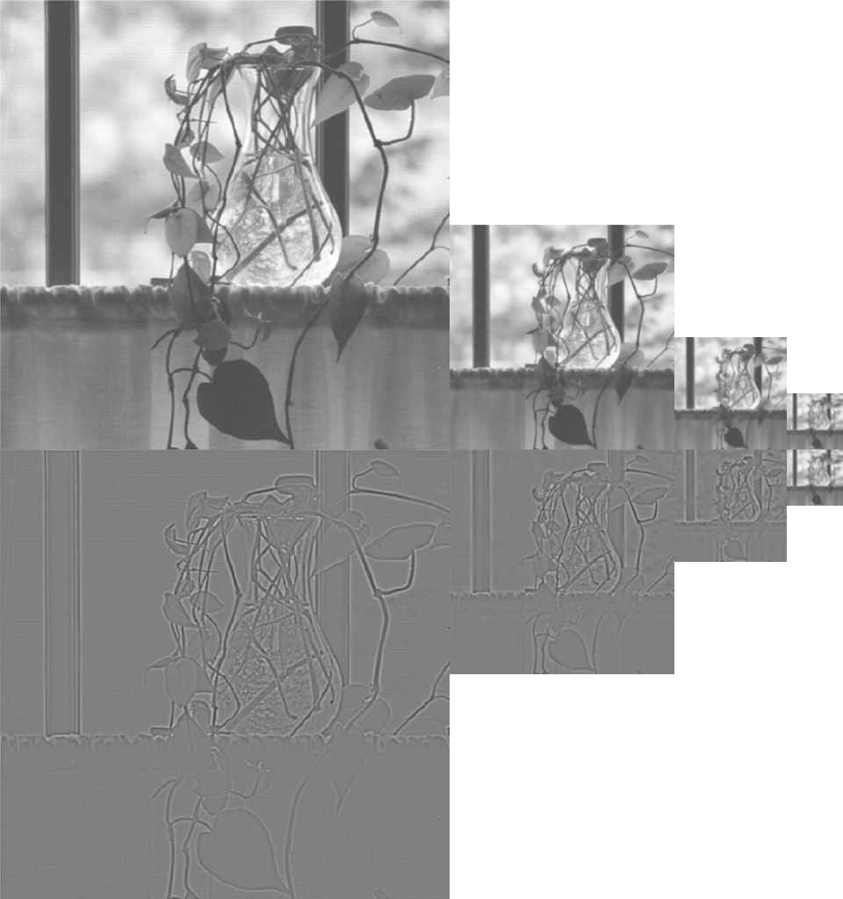
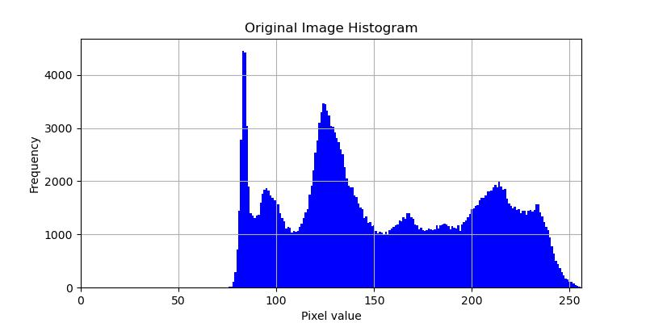
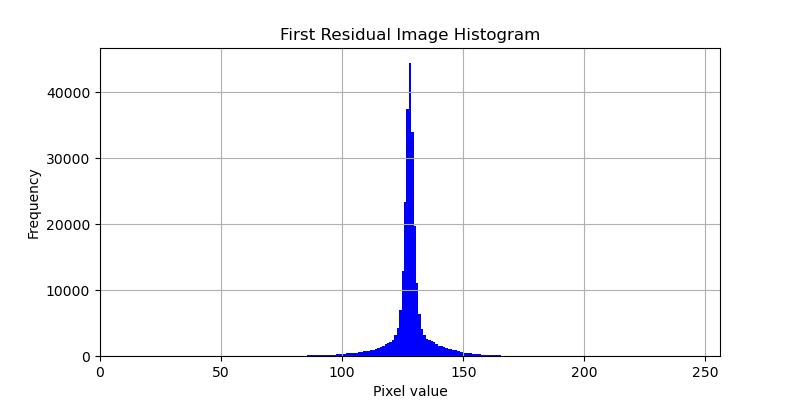
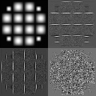
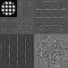
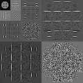
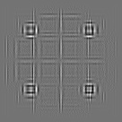
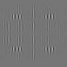

# Lab 4 小波变换

**实验编号：PB21020685 王润泽**

## 1. 实验内容

本实验旨在使用 Python 实现近似金字塔和预测残差金字塔，并完成二维快速小波变换及基于小波的边缘检测。

## 2. 实验原理

### 2.1 近似金字塔与预测残差金字塔

金字塔是一种图像的多分辨率表示方法，通过逐层下采样和生成残差图像，有效地捕捉图像在不同尺度下的信息。

- **近似金字塔**：利用低通滤波和下采样生成近似图像，从而重建低频信息。
- **预测残差金字塔**：通过计算当前层与前一层的差异，得到残差图像，关注图像中的高频细节。

### 2.2 二维快速小波变换

小波变换是一种时频分析技术，能够为图像提供多尺度表示。通过多层小波变换，获取不同频率的信息。

- **小波变换步骤**
  1. 应用低通和高通滤波器，获取低频和高频系数。
  2. 进行下采样，以得到不同尺度的图像。

### 2.3 基于小波的边缘检测

小波变换在捕捉图像边缘信息方面表现出色。通过分析小波系数，可以实现有效的边缘检测。

- **边缘检测方法**
  1. 应用小波变换获取高频系数。
  2. 根据高频系数的阈值进行分割，提取边缘信息。

## 3. 实验结果

### 3.1 近似金字塔与预测残差金字塔

对测试图像进行近似金字塔和预测残差金字塔处理，结果如下：

      

原图与残差图的直方图如下：

           

### 3.2 二维快速小波变换

对测试图像进行二维快速小波变换，结果如下：

- 原图与一尺度 FWT：

           

- 二尺度 FWT 与三尺度 FWT：

           

### 3.3 基于小波的边缘检测

对测试图像进行基于小波的边缘检测，结果如下：

           

通过小波变换和金字塔结构，我们能够有效地提取图像中的细节和边缘信息。

## 4. 结论

通过本实验，我们成功实现了近似金字塔和预测残差金字塔的构建，并有效提取出图像的细节信息。保存的直方图为后续图像处理提供了有价值的参考，验证了金字塔结构在多分辨率图像处理中的有效性。