# Lab 5 形态学图像处理

**实验编号：PB21020685 王润泽**

## 1. 实验内容

本实验旨在使用 Python 实现多种形态学图像处理算法，复现教材结果，具体包括长字符提取、空洞填充、边界清除、顶帽变换纠正阴影、检测圆形颗粒尺寸和纹理分割等形态学操作。

## 2. 实验原理

### 2.1 长字符提取

在本实验中，我们使用形态学操作来提取图像中的长字符。具体步骤如下：

1. **读取图像**：首先读取输入的灰度图像，将其加载为一个二维矩阵，便于后续处理。

2. **阈值处理**：通过阈值处理将图像二值化，将图像中的灰度值转化为0和255，以便后续进行形态学操作。通常情况下，图像中的字符部分会被转换为白色（255），背景为黑色（0）。

3. **腐蚀操作**：使用一个长条形的结构元素对图像进行腐蚀操作。腐蚀操作会减少图像中白色区域的大小，这有助于去除图像中的细小噪声。腐蚀后的图像保留了长字符的结构，而去除了图像中的小噪声。

4. **开操作**：接下来，使用相同的长条形结构元素对图像进行开操作。开操作是先进行腐蚀，再进行膨胀，它有助于进一步去除图像中的噪声，同时提取图像中的长字符。由于开操作具有去除细小噪声的特性，可以清晰地提取出长条形状的字符。

5. **重建开操作**：最后，使用较小的结构元素对腐蚀后的图像进行重建开操作。通过重建开操作，可以恢复图像的主要结构，同时去除腐蚀过程中丢失的部分，进一步清晰化长字符的形态。

### 2.2 空洞填充

在本实验中，我们使用形态学操作来填充图像中的空洞。具体步骤如下：

1. **图像补集**：首先通过反转输入图像（将0变为255，255变为0）得到图像的补集。

2. **标记图像**：我们构造标记图像，将图像的四个边界设置为255（外部区域），其余部分设置为0。标记图像用于引导后续的形态学重建操作。

3. **重建操作**：通过膨胀标记图像，并与图像补集进行最小值运算，逐步填充标记区域。膨胀操作填补了图像中的空洞，直到图像不再变化。

4. **结果反转**：完成空洞填充后，我们反转图像，以恢复空洞填充后的原始样式，得到最终的填充结果。

### 2.3 边界清除

在本实验中，我们使用形态学操作来清除图像中的边界。具体步骤如下：

1. **验证图像的灰度值**：首先，确保图像仅包含黑白两种灰度值（0 和 255）。如果图像中有其他灰度值，程序会报错。

2. **标记图像**：对图像的边界进行标记。具体做法是，将图像的四个边（上、下、左、右）复制到标记图像中。这些边界区域将用于后续的重建操作。

3. **重建开操作**：对标记图像进行重建开操作。重建操作通过膨胀标记图像并与原图进行最小化，逐步恢复标记区域的结构。迭代这一过程直到图像稳定。重建开操作的作用是恢复图像中边界区域的背景。

4. **边界清除**：最后，通过从原图中减去重建后的图像来去除边界部分，得到去除边界后的清除图像。

### 2.4 顶帽变换与阈值处理

在本实验中，我们使用顶帽变换（Top-Hat Transform）来增强图像中的细节，并结合阈值处理进行图像分割。具体步骤如下：

1. **阈值处理**：首先，通过计算图像的特定百分位值（默认百分位为72）来确定阈值。然后，使用该阈值对图像进行二值化，得到二值化图像。

2. **开操作**：使用一个半径为40的圆盘结构元素对图像进行开操作。开操作可以去除图像中的小物体和噪声，保留较大的结构。

3. **顶帽变换**：通过从原始图像中减去开操作的结果来计算顶帽变换。这一操作有助于增强图像中亮度变化较大的部分，特别是图像中的细节区域。

4. **阈值处理后的顶帽变换**：对顶帽变换结果进行阈值处理，将其二值化，从而进一步提取出图像中的特征区域。

### 2.5 检测圆形颗粒尺寸

在本实验中，我们使用形态学操作来检测图像中的圆形颗粒并估算其尺寸。具体步骤如下：

1. **图像平滑**：首先，我们对图像应用形态学滤波器进行平滑。通过使用半径为10的圆盘结构元素执行开操作，可以有效去除图像中的小噪声，同时保留较大的结构。

2. **不同半径的开操作**：接着，我们使用不同半径的圆盘结构元素对平滑后的图像进行开操作。通过对比每个半径图像的像素值之和，我们可以获得颗粒的大小信息。随着半径的增大，开操作会去除更多的细节，从而揭示颗粒的尺寸特征。

3. **计算表面区域差值**：对于每个半径的开操作，我们计算其与前一个半径图像之间的像素值之和的差异。通过这些差异，我们可以推测出颗粒的边缘和形状。

4. **可视化**：最后，通过将不同半径下的表面区域差值绘制成图表，我们可以直观地看到颗粒尺寸与半径之间的关系。这个图表可以帮助我们分析颗粒的大小分布以及颗粒形状的变化。

### 2.6 纹理分割

在本实验中，我们通过形态学操作进行纹理分割，目的是分离出图像中的不同纹理区域。具体步骤如下：

1. **闭操作**：首先，使用半径为30的圆盘形态学结构元素进行闭操作。闭操作可以填补图像中的小孔洞，并平滑物体边界，从而消除细小的噪声。

2. **开操作**：接着，使用半径为60的圆盘形态学结构元素进行开操作。开操作有助于去除小物体，同时保留较大的结构。通过这一步骤，我们进一步消除不必要的小细节。

3. **梯度操作**：然后，使用大小为3×3的矩形结构元素执行形态学梯度操作。形态学梯度用于突出物体的边界，使得物体的轮廓更加清晰。

4. **边界叠加**：最后，将梯度图像中的非零像素值（即边界部分）叠加到原图像上，形成一个包含边界的图像。这样，我们可以直观地看到图像中的纹理边界，帮助进一步的纹理分析和分割。

## 3 实验结果

### 3.1 长字符提取

对测试图像进行长字符提取，结果如下：

  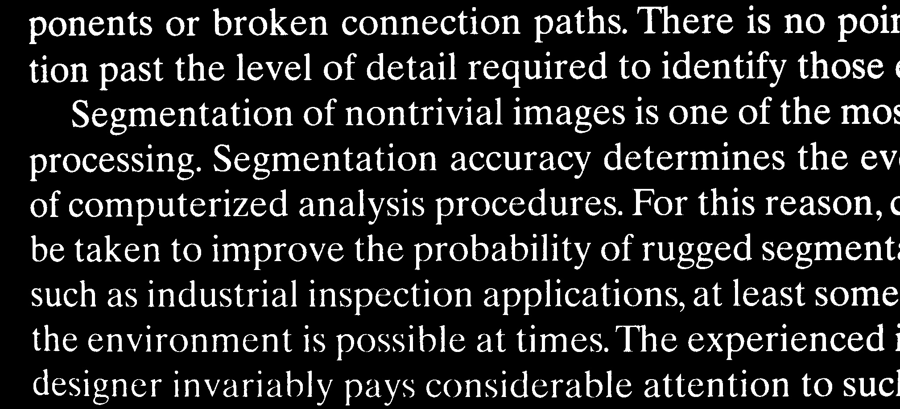
  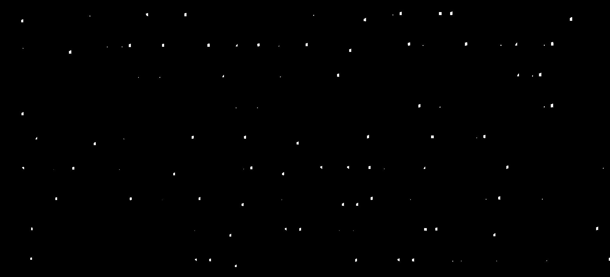
  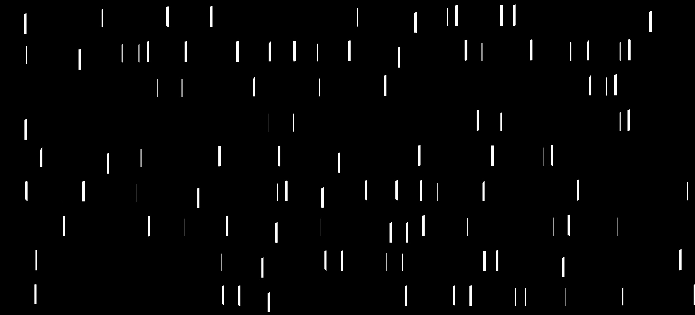
  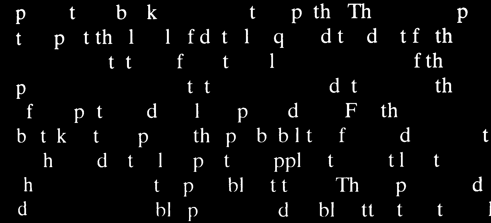

长字符提取的效果通过腐蚀和开操作有效去除细小噪声，保留了图像中的长字符结构。

### 3.2 空洞填充

对测试图像进行空洞填充处理，结果如下：

  
  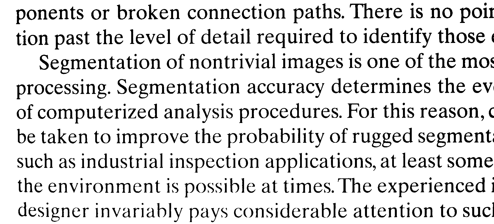
  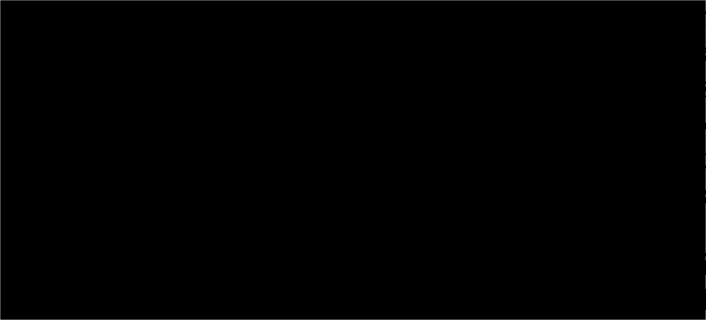
  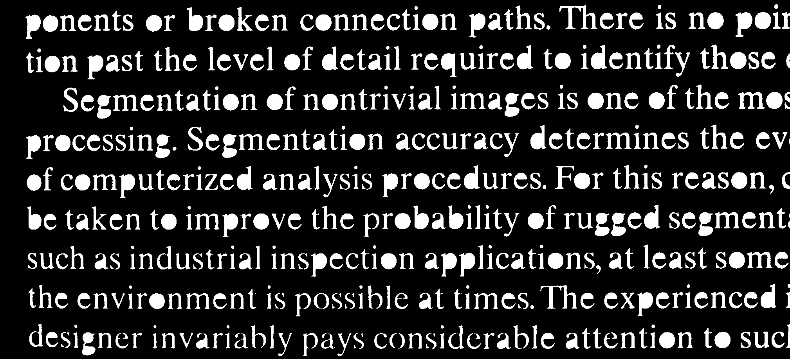

通过形态学操作，空洞在图像中得到了有效的填充，恢复了图像中的结构信息。

### 3.3 边界清除

对测试图像进行边界清除操作，结果如下：

  
  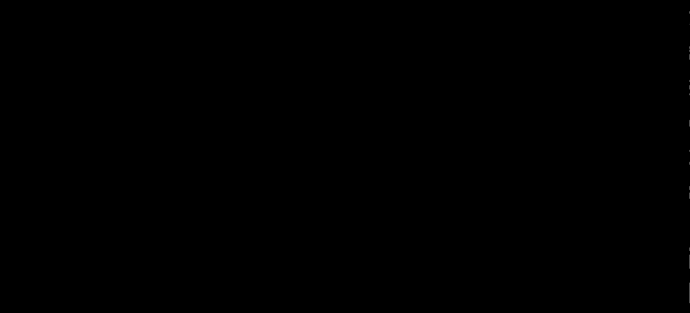
  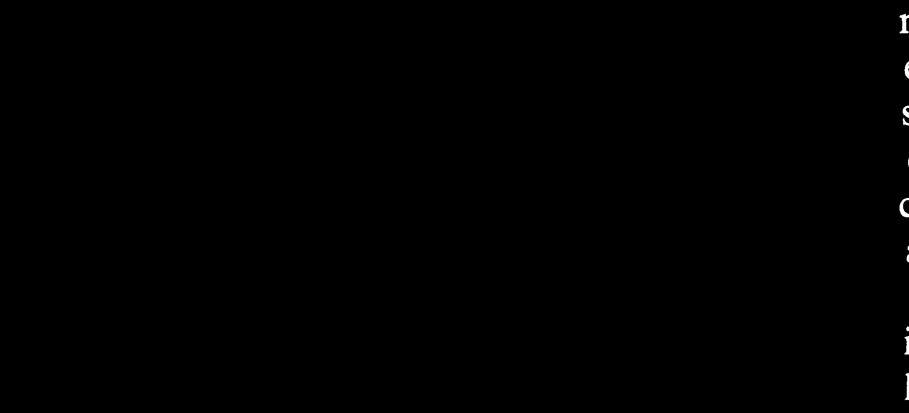
  

边界清除操作成功去除了图像中的边界干扰，保留了主要的图像结构。

### 3.4 顶帽变换与阈值处理

对测试图像进行顶帽变换与阈值处理，结果如下：

  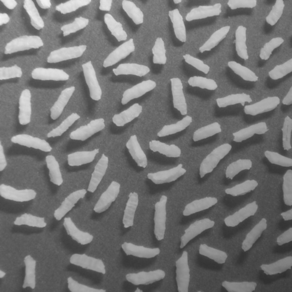
  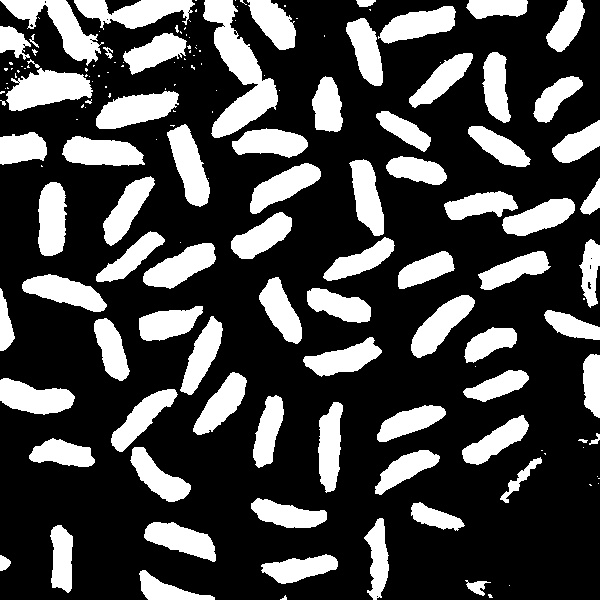
  
  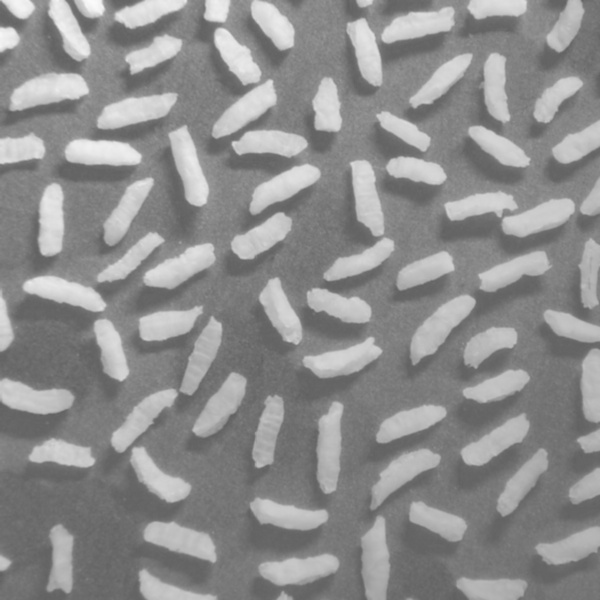
  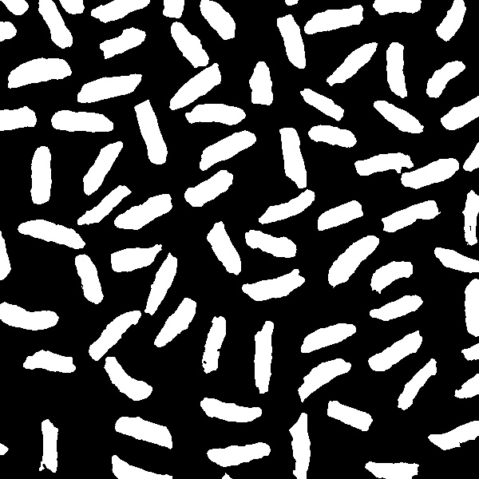

顶帽变换有助于增强图像中的细节，通过与阈值处理结合，有效提取了图像中的特征区域。

### 3.5 检测圆形颗粒尺寸

对测试图像进行圆形颗粒尺寸检测，结果如下：

  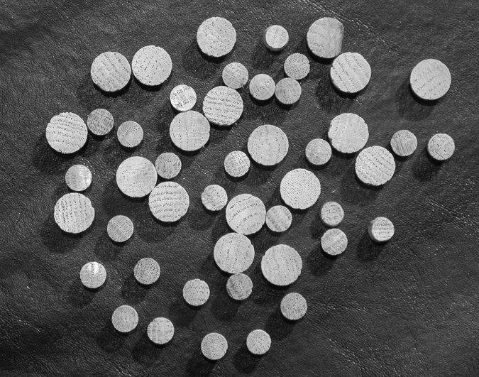
  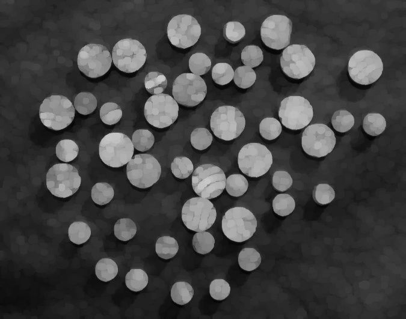
  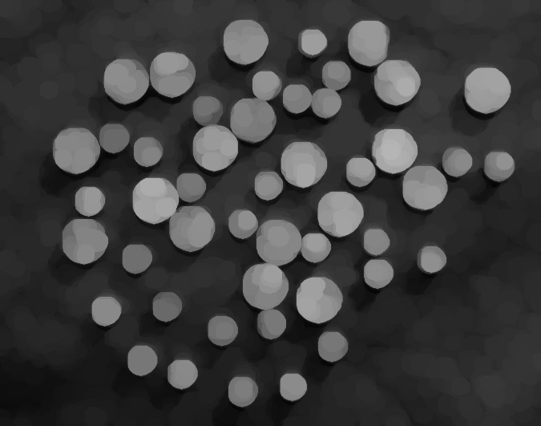
  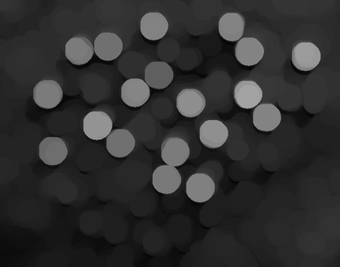
  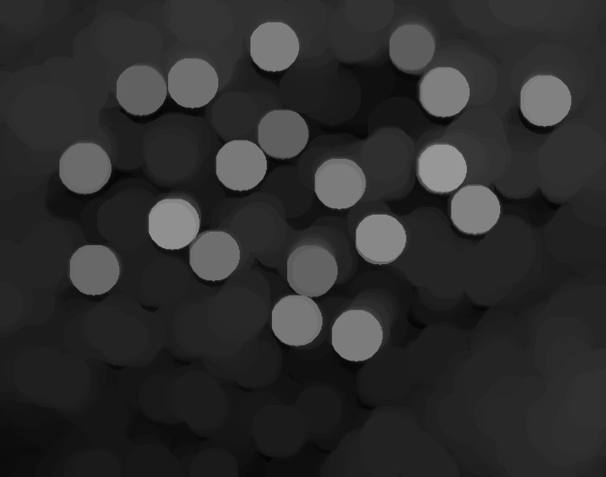
  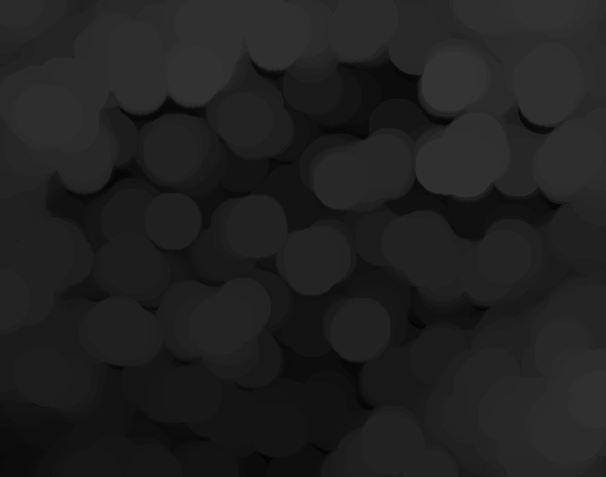
  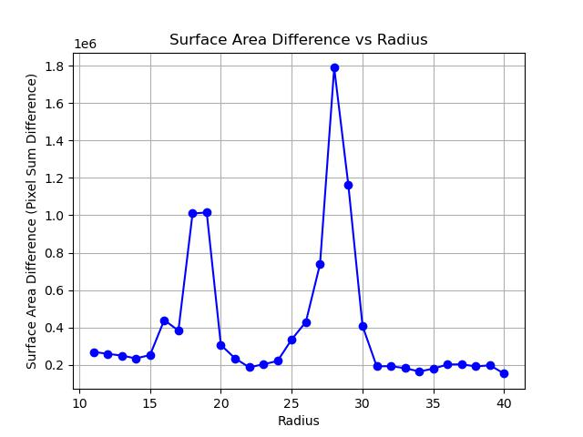

通过形态学操作，圆形颗粒的尺寸得到了有效提取，颗粒信息更加清晰。

### 3.6 纹理分割

对测试图像进行纹理分割处理，结果如下：

  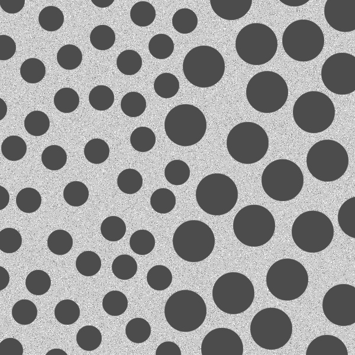
  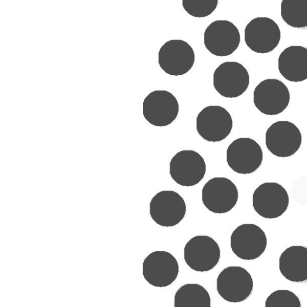
  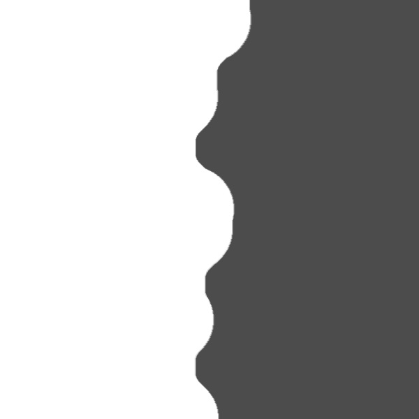
  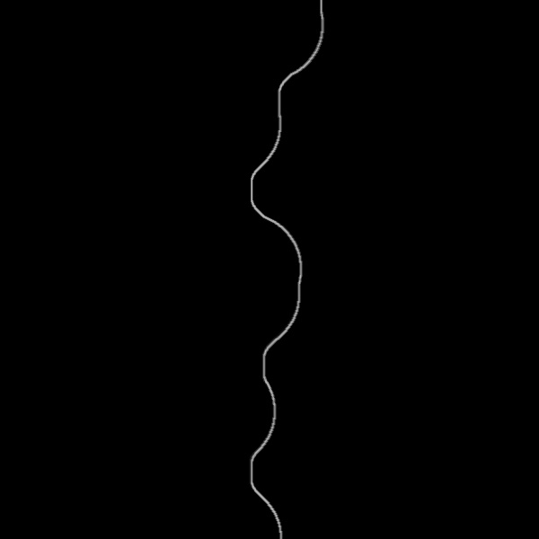
  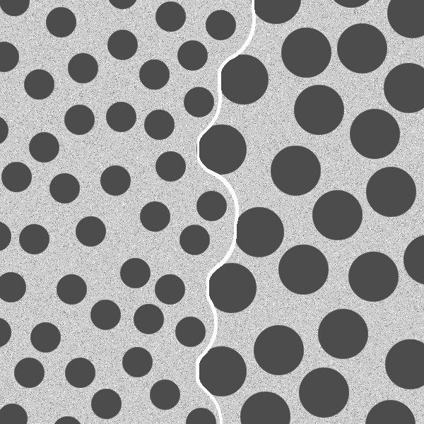

通过形态学操作实现的纹理分割，成功分离了图像中的不同纹理区域，为后续分析提供了有效的支持。

## 4. 实验结论

本实验通过实现多种形态学图像处理算法，成功复现了教材中的实验结果，并验证了形态学操作在图像处理中的有效性。具体结论如下：

1. **长字符提取**：通过腐蚀、开操作以及重建开操作的结合，我们成功提取了图像中的长字符结构，去除了细小噪声，保留了主要的字符信息。

2. **空洞填充**：通过形态学补集与重建操作，空洞在图像中得到了有效填充，恢复了图像的结构信息，确保了图像的完整性。

3. **边界清除**：边界清除操作成功去除了图像中的干扰边界，通过重建开操作去除了多余的边界信息，保留了图像的主要结构特征。

4. **顶帽变换与阈值处理**：顶帽变换有效增强了图像中的细节信息，与阈值处理结合后，成功提取了图像中的特征区域，帮助突出细节部分，改善了图像的视觉效果。

5. **圆形颗粒尺寸检测**：通过不同半径的开操作，我们准确检测出了图像中的圆形颗粒，并有效估算了颗粒的尺寸，揭示了颗粒的大小分布和形态特征。

6. **纹理分割**：通过闭操作、开操作和梯度操作的组合，成功实现了图像中的纹理分割，分离了不同的纹理区域，为后续的图像分析和处理奠定了基础。

总体而言，实验验证了形态学图像处理在图像降噪、特征提取和分割等方面的强大功能，能够有效处理不同类型的图像问题，具有广泛的应用前景。