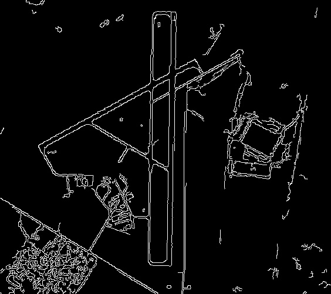
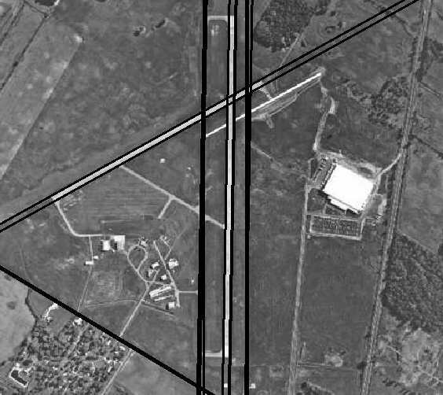
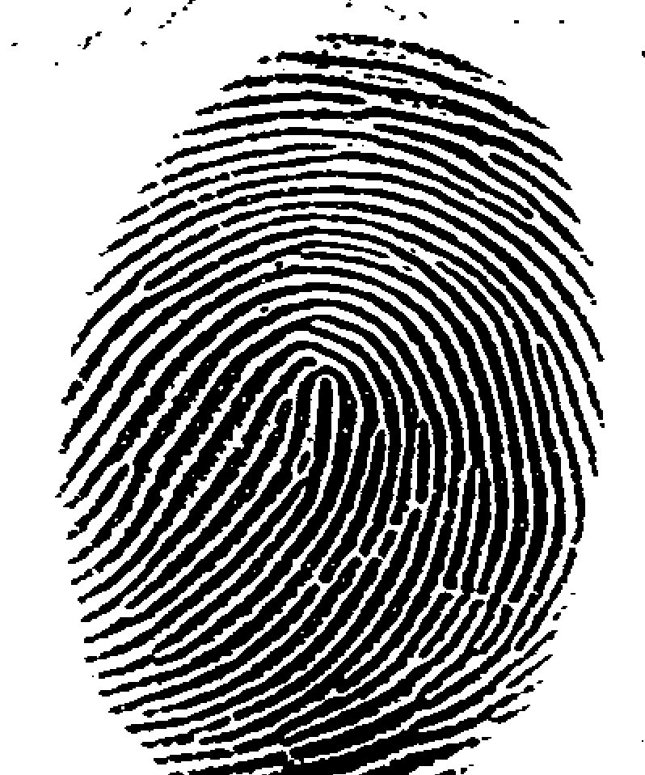
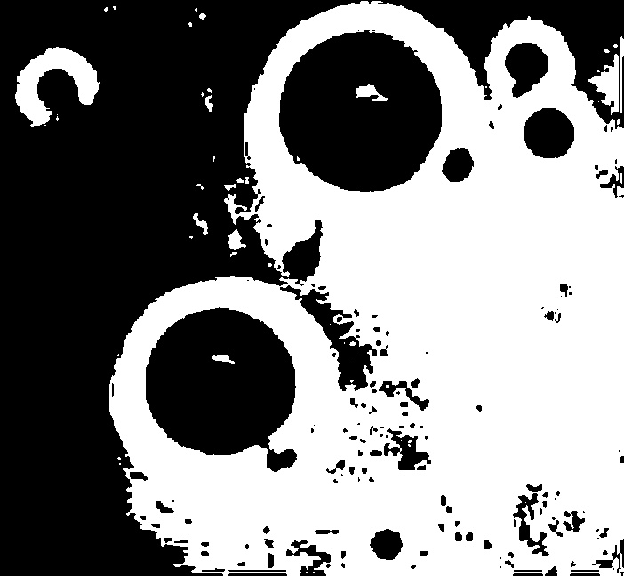
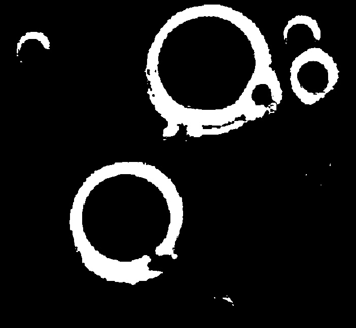
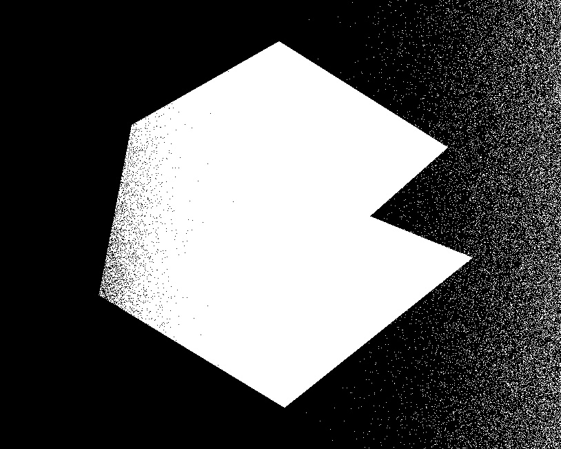
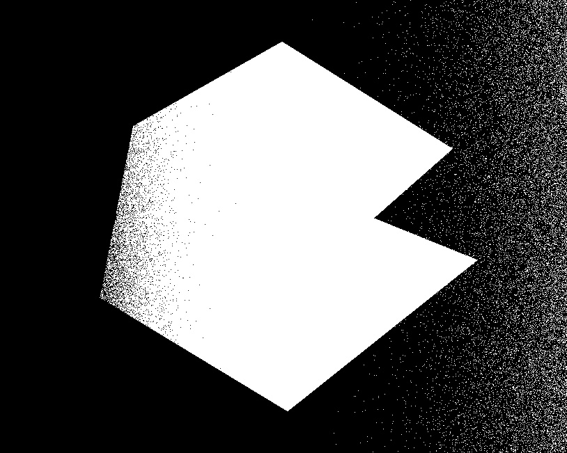
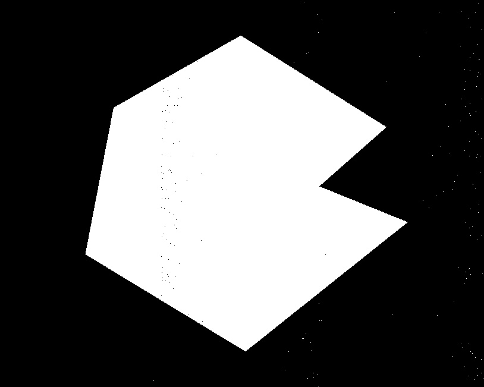

# Lab 6 霍夫变换与阈值分割

**实验编号：PB21020685 王润泽**

## 1. 实验内容

本实验旨在使用 Python 实现霍夫变换中的直线检测，以及三种不同的阈值分割算法，包括全局阈值处理、Otsu阈值分割、分块可变阈值分割。

## 2. 实验原理

### 2.1 霍夫变换中的直线检测

霍夫变换（Hough Transform）是一种常用的图像处理方法，用于检测图像中的几何形状，尤其是直线。它通过将图像空间的直线问题转换为参数空间的峰值检测问题来实现直线检测。

霍夫变换的核心原理是：

- **极坐标表示**：在图像中，每条直线可以表示为极坐标形式：

  $$ρ=x⋅cos⁡θ+y⋅sin⁡θ\rho = x \cdot \cos \theta + y \cdot \sin \theta$$

  其中，$$ \theta $$是直线的倾斜角度，$ \rho $ 是从原点到直线的最短距离。

- **参数空间**：霍夫变换将图像空间中的每一个点映射到极坐标的参数空间中，参数空间通常由 $ \rho $ 和 $ \theta $ 组成。通过检测该空间中的峰值，可以找到图像中的直线。

- **累积器**：将每个边缘点的 $ \theta $ 和 $ \rho $ 值计算并在累积器中进行投票，找到投票最多的区域即为直线的位置。

### 2.2 全局阈值处理

全局阈值处理是一种将图像灰度值分为两类（前景与背景）的方法。通过设置一个固定的阈值 $ T $，将图像的每个像素值与该阈值进行比较：

- 如果像素值 $I(x, y)$ 大于或等于阈值 $ T $，则该像素被认为是前景（例如，白色）。
- 如果像素值 $ I(x, y) $ 小于阈值 $ T $，则该像素被认为是背景（例如，黑色）。

全局阈值处理的基本形式如下：

$$
I_{\text{thresh}}(x, y) =
\begin{cases}
1, & \text{if } I(x, y) \geq T \\
0, & \text{if } I(x, y) < T
\end{cases}
$$
其中，$ I_{\text{thresh}}(x, y) $ 是处理后的二值图像，$ I(x, y) $ 是原图像的像素值。

### 2.3 Otsu阈值分割

Otsu阈值分割是一种自动化的图像阈值选择方法。该方法通过最大化类间方差（即前景和背景之间的差异）来选择最优的阈值。具体步骤如下：

1. **计算直方图**：计算图像的灰度直方图。
2. **类间方差**：Otsu算法通过寻找使得类间方差最大的阈值 $ T_{\text{Otsu}} $，以此来分割图像。类间方差定义为前景与背景的加权方差之和，目的是使得前景和背景的像素尽量分开。

Otsu的公式如下：

$$σB2(T)=n1(T)(μ1(T)−μ)2+n2(T)(μ2(T)−μ)2n1(T)+n2(T)\sigma_B^2(T) = \frac{n_1(T)(\mu_1(T) - \mu)^2 + n_2(T)(\mu_2(T) - \mu)^2}{n_1(T) + n_2(T)}$$

其中：

- $ n_1(T) $ 和 $ n_2(T) $ 分别是低于和高于阈值 $ T $ 的像素数量。
- $ \mu_1(T) $ 和 $ \mu_2(T) $ 分别是低于和高于阈值的像素的平均灰度值。
- $ \mu $ 是图像的整体均值。

### 2.4 分块可变阈值分割

分块可变阈值分割方法通过将图像划分为多个小块（区域），然后分别计算每个小块的局部阈值进行分割。与全局阈值不同，分块阈值考虑了图像中不同区域的灰度分布，从而在不同区域使用不同的阈值。具体步骤如下：

1. **图像分块**：将图像划分为多个小块，通常是固定大小的矩形区域。
2. **局部阈值计算**：对于每个小块，计算该小块的局部阈值，可以使用均值、标准差或其他统计量来计算。
3. **分割图像**：根据每个小块的局部阈值，对整个图像进行分割。

该方法的优势是能有效处理图像中光照不均或局部对比度差异较大的情况，常用于处理复杂背景的图像。

## 3 实验结果

### 3.1 霍夫变换中的直线检测

对测试图像进行边缘检测与直线检测，保留累加值大于150的直线，结果如下：

  
  

可见大部分长直线都被有效检测出来。

### 3.2 全局阈值处理

对测试图像进行全局阈值处理，结果如下：

  

### 3.3 Otsu阈值分割

对测试图像进行全局阈值分割和Otsu阈值分割，结果如下：

  
  

Otsu阈值分割效果远远优于全局阈值分割。

### 3.4 分块可变阈值分割

对测试图像进行全局阈值分割、Otsu阈值分割、分块可变阈值分割，结果如下：

  
  
  

可见，分块可变阈值分割效果最好。

## 4. 实验结论

本实验成功地实现了霍夫变换与三种阈值分割方法，并验证了它们在不同图像条件下的有效性和局限性。通过对比分析，Otsu算法和分块可变阈值分割在图像分割任务中表现更为优秀，尤其在处理复杂背景和不均匀光照的情况下，能够提供更好的分割效果。