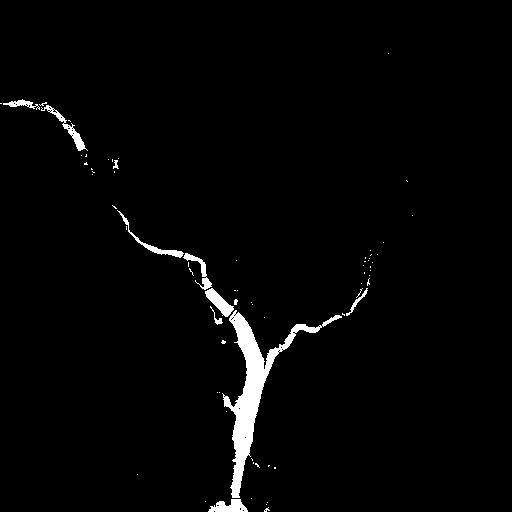
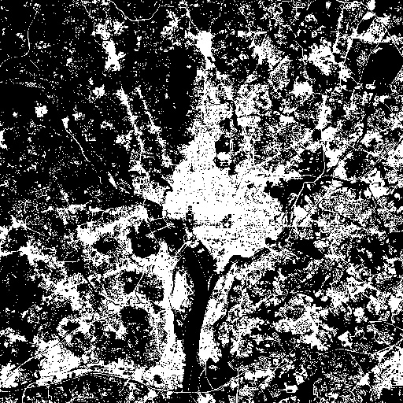
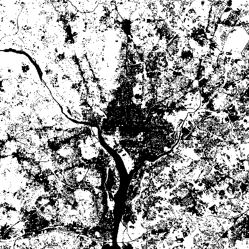
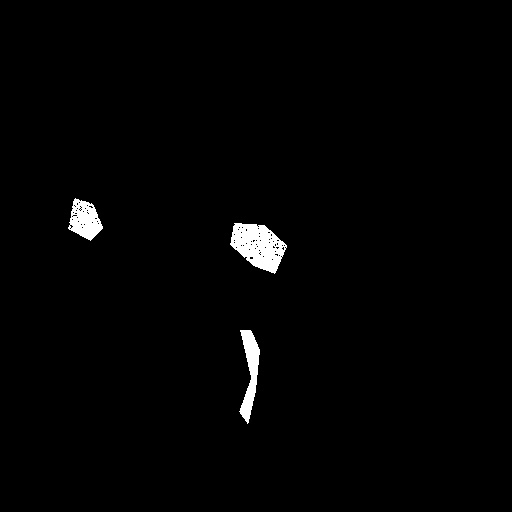

# Lab7 多光谱数据的贝叶斯分类

**实验编号：PB21020685 王润泽**

## 1. 实验内容

本实验旨在使用 Python 实现多光谱数据的贝叶斯分类。

## 2. 实验原理

### 2. 实验原理

#### 2.1 贝叶斯分类器的基本理论

贝叶斯分类器是一种基于贝叶斯定理的统计分类方法，公式为：

$$P(C_k \mid x) = \frac{P(C_k) \cdot P(x \mid C_k)}{P(x)}$$

其中：

- $P(C_k \mid x)$ 为后验概率，即给定样本 $x$ 属于类别 $C_k$ 的概率；
- $P(C_k)$ 为先验概率，表示类别 $C_k$ 在总体样本中的分布；
- $P(x \mid C_k)$ 为似然函数，表示样本 $x$ 在类别 $C_k$ 条件下的概率；
- $P(x)$ 为边际概率，可通过归一化后验概率忽略。

#### 2.2 高斯朴素贝叶斯模型

在高斯朴素贝叶斯模型中，假设特征服从正态分布，则条件概率 $P(x_i \mid C_k)$ 表达为：

$$P(x_i \mid C_k) = \frac{1}{\sqrt{2 \pi \sigma_k^2}} \exp\left(-\frac{(x_i - \mu_k)^2}{2 \sigma_k^2}\right)$$

其中：

- $\mu_k$ 和 $\sigma_k^2$ 分别是类别 $C_k$ 下第 $i$ 个特征的均值和方差。

#### 2.3 模型训练与预测

1. **训练**：
   - 对每个类别计算其先验概率 $P(C_k)$；
   - 计算每个类别下各特征的均值 $\mu_k$ 和方差 $\sigma_k^2$。
2. **预测**：
   - 对于待分类样本 $x$，计算其在每个类别 $C_k$ 的后验概率；
   - 选择后验概率最大的类别作为预测结果。

#### 2.4 多光谱数据分类

多光谱数据由多个波段组成，每个波段表示同一场景在不同光谱下的反射值。分类过程如下：

1. 将多光谱图像的每个像素的多个波段值视为一个特征向量；
2. 利用标签掩膜（mask）生成训练样本；
3. 使用贝叶斯分类器进行分类，得到每个像素的类别预测；
4. 将预测结果重塑为图像形状，生成分类图。

#### 2.5 数据处理流程

1. **数据组织**：
   - 读取多光谱图像数据和掩膜标签；
   - 将每个像素的光谱信息重塑为二维特征矩阵。
2. **模型训练**：
   - 过滤背景类（类别 0），仅使用有效样本进行训练；
   - 计算各类别的统计特性（均值、方差）。
3. **模型预测**：
   - 利用贝叶斯分类器预测每个像素的类别；
   - 将预测类别重新组织为分类结果图。

#### 2.6 性能评估

通过计算混淆矩阵，评估分类器对各类别的预测性能，并将预测错误的像素可视化以分析模型的分类效果。

## 3 实验结果

对测试图像进行贝叶斯分类，结果如下：

  
  
  

训练数据的预测结果如下，黑点代表预测错误:

  

## 4. 实验结论

本实验成功地实现了多光谱数据的贝叶斯分类，和课本上的结果相近，对于训练数据实现了较好的分类。